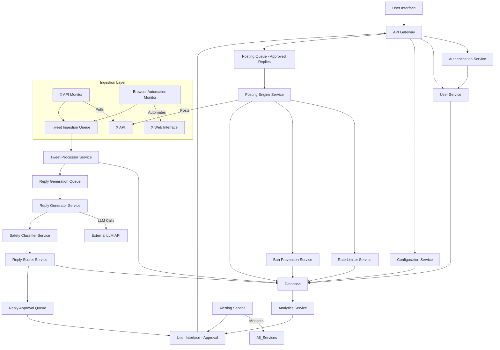

# X Growth Automation System Design

## 1. Executive Summary

X is an AI-powered X/Twitter growth operating system designed to automate engagement for serious founders and creators. The system meticulously monitors two primary sources: the user's **Home timeline** (tweets from accounts the user follows) and a specific **X List** (list ID `2021997563394810120`). Upon detecting new tweets, X generates high-quality, human-sounding replies and posts them safely, adhering to stringent ban-prevention protocols. The core philosophy of X prioritizes safety, human-like behavior, and long-term account health, ensuring scalable architecture and robust performance. Key features include intelligent feed monitoring, an advanced reply generation pipeline, a queue-based posting engine with a token-bucket rate limiter, and a multi-layered ban prevention system.

## 2. MVP Scope (Phase 1)

The Minimum Viable Product (MVP) for X is designed to deliver a powerful yet contained set of features that validate the core value proposition while prioritizing stability and safety. The MVP scope includes real-time monitoring of both the user's **Home timeline** and the specified **X List** (`2021997563394810120`). It features a sophisticated **Reply Engine** for generating high-quality, human-like replies with various styles and safety filters. A queue-based **Posting Engine** manages scheduling and adheres to strict batching rules (5 replies followed by a 60-second cooldown) and a global token-bucket rate limiter. Foundational layers of the **Ban Prevention System**, including the token bucket, adaptive backoff, and error detection, are integral to the MVP. Finally, the system provides **Basic Analytics** on key metrics and an **Approval UI** to ensure human oversight before any content is posted.

To maintain focus and reduce initial complexity, several features are explicitly excluded from the MVP. These include monitoring a top-1000 handles list, which presents significant scaling and rate-limiting challenges, and support for multiple X Lists. Multi-account orchestration is also deferred, as managing multiple accounts introduces substantial complexity in authentication and ban prevention. Finally, enterprise-level features such as advanced reporting and team collaboration are postponed to later phases.

This focused MVP scope is strategic, as it delivers immediate value by automating engagement from the most relevant sources—the user's personal timeline and a curated list—while rigorously prioritizing system safety and stability. This approach allows for rapid iteration and the crucial validation of the core reply generation and ban prevention algorithms, which are paramount for the product's long-term success and user trust.

## 3. Full PRD (Detailed)

### User Personas

The system caters to two primary user personas: **The Solopreneur/Creator** and **The Startup Founder**. The Solopreneur/Creator aims to grow their personal brand, increase engagement, attract leads, and build a community on X. Their main pain points include time constraints, difficulty maintaining consistent engagement, and the fear of account suspension due to aggressive automation. They require reliable, safe, and intelligent automation that feels authentic, with minimal manual oversight. The Startup Founder, on the other hand, seeks to drive product awareness, engage with industry leaders, recruit talent, and establish thought leadership. Their challenges involve limited marketing budgets and the need to maximize reach on X, coupled with a demand for data-driven insights for content strategy. They require a scalable solution with robust analytics, capable of adapting to evolving X algorithms without compromising account health.

### Core User Journeys

The core user journeys begin with **Onboarding & Setup**, where users securely connect their X account, configure basic preferences such as reply styles and safety thresholds, and initiate the system's monitoring of their Home timeline and the specified X List. This is followed by **Daily Engagement & Review**, during which users access a dashboard to view detected tweets and generated reply candidates. They can then review, approve, or reject these replies, with approved replies being queued for posting. Throughout this process, users actively monitor their account health and performance metrics. The final journey involves **System Monitoring & Adjustment**, where the system continuously monitors X feeds, generates replies, and posts approved content. The integrated ban prevention system actively adjusts posting behavior based on real-time signals, and users receive alerts for critical events, such as potential ban risks or system errors.

### Feature Breakdown

The system's functionality is segmented into several key services. The **Monitoring Service** handles X API integration for polling both the Home timeline and the specified List, with a robust browser automation fallback using Playwright for data ingestion. It also manages tweet deduplication and freshness windows. The **Reply Generation Service** integrates with LLMs (e.g., OpenAI, Gemini) for generating replies, employing contextual prompt engineering based on user AI rules and tweet context, along with safety classification and quality scoring. The **Posting Service** utilizes an asynchronous queue (e.g., Redis Streams, Kafka) to manage approved replies, enforcing a global and per-user token-bucket rate limiter, batch posting logic (5 replies followed by a 60-second cooldown), human-like random delays, and an adaptive backoff mechanism. The **Ban Prevention Service** is a critical component, encompassing account health scoring, error detection and signal processing (for 429s, 403s, and other warnings), emergency pause and slow-mode activation, and duplicate reply prevention (both exact and semantic). For insights, the **Analytics & Reporting Service** provides a dashboard for key metrics like replies posted, engagement, and account health score, alongside comprehensive audit logs. Finally, the **User Interface (Web)** offers a dashboard for monitoring and analytics, an intuitive reply approval/rejection interface, and configuration settings for user preferences.

### Success Metrics

Success metrics for X are multifaceted, focusing on both user satisfaction and system performance. High **User Retention** will indicate satisfaction with the automation's quality and safety. **Engagement Rate** will measure the increase in average replies, likes, and retweets on user's X posts. Maintaining a consistently high average **Account Health Score** across all users is crucial, as is a high **Reply Approval Rate**, which signifies the quality and relevance of generated replies. Furthermore, **System Uptime & Reliability** will be tracked through minimal downtime and error rates for core services, while **Latency** will measure the efficiency of tweet detection and reply generation.

### Risks

Several critical risks are associated with operating an X growth automation system. **X API Changes/Restrictions** pose a significant threat, as X frequently updates its API and policies, potentially disrupting monitoring or posting functionalities. Mitigation strategies include implementing a robust browser automation fallback, continuously monitoring X developer announcements, and adopting agile development practices. **Account Suspension/Shadowban** remains a persistent risk despite comprehensive ban prevention measures. This is mitigated through an extremely strong, multi-layered ban prevention system, continuous research into X's detection mechanisms, and transparent communication with users regarding these risks. **LLM Quality & Cost** are also concerns, as reply quality can vary, and LLM API costs can escalate. To address this, the system will implement robust quality scoring, fine-tune prompts, explore cost-effective LLM providers, and allow users to set quality thresholds. **Scalability Challenges** may arise as the user base grows, making the scaling of monitoring, reply generation, and posting services complex. This is addressed by designing with horizontal scalability in mind from day one, utilizing managed services, and implementing efficient queuing mechanisms. Finally, **Data Privacy & Security** are paramount, requiring stringent measures for handling user X account data. Adherence to industry best practices for data encryption, access control, and secure API key management is essential.

## 4. System Architecture

X will employ a microservices-oriented architecture, leveraging cloud-native principles for scalability, resilience, and maintainability. The system will consist of several decoupled services communicating asynchronously, primarily via message queues.

### High-Level Architecture (Text Form)



### Service Breakdown

The system is composed of several distinct microservices. The **User Service** is responsible for managing user profiles, X account connections, and subscription data. The **Configuration Service** stores user-defined settings, AI rules, and reply preferences. For tweet ingestion, the **X API Monitor Service** periodically polls the X API for new tweets from both the Home timeline and the specified List, leveraging `statuses/home_timeline` and `lists/statuses` endpoints. As a robust fallback, the **Browser Automation Monitor Service** uses Playwright to simulate browser activity and scrape tweets, activating when X API access is restricted or for enhanced stealth. The **Tweet Processor Service** then deduplicates incoming tweets, enriches their metadata, stores them in the database, and triggers the reply generation process. The **Reply Generator Service** orchestrates LLM calls to produce multiple reply candidates based on tweet context and user AI rules. These candidates are then passed to the **Safety Classifier Service**, which filters them for toxicity, spam, and brand safety using NLP models, and subsequently to the **Reply Scorer Service**, which assigns a quality score based on relevance, value, and conversation potential. The **Posting Engine Service** consumes approved replies from a queue, applies batching logic, interacts with the **Rate Limiter Service** (which enforces global and per-user token-bucket rate limits) and the **Ban Prevention Service** (which monitors account health, detects anomalous behavior, and triggers adaptive backoff or emergency pauses), before posting replies to X via API. Finally, the **Analytics Service** processes and aggregates operational data for user dashboards and reporting, while the **Alerting Service** notifies users and administrators of critical system events or account health issues.

### Data Flow

The data flow within the system follows a clear, asynchronous path. **Tweet Ingestion** begins with the X API Monitor or Browser Automation Monitor fetching tweets, which are then routed to the `Tweet Ingestion Queue`. From there, the Tweet Processor Service consumes these tweets, stores them in the `Tweets` table in the database, and initiates the reply generation process. For **Reply Generation**, the Tweet Processor Service pushes new tweets to the `Reply Generation Queue`. The Reply Generator Service then processes these, making calls to the External LLM API, followed by the Safety Classifier Service and Reply Scorer Service. The resulting reply candidates are stored in the database and pushed to the `Reply Approval Queue`. During **Reply Approval**, the User Interface displays these candidates, allowing users to approve or reject them. Approved replies are then moved to the `Posting Queue`. **Reply Posting** involves the Posting Engine Service consuming from this queue, checking with the Rate Limiter Service and Ban Prevention Service, posting the replies to the X API, and updating the `Reply History` and `Audit Logs` in the database. Finally, **Analytics** are generated by the Analytics Service, which reads data from the `Tweets`, `Reply History`, and `Audit Logs` tables to populate the User Interface dashboards.

### Local vs. Cloud Components

The system architecture distinguishes between **Cloud Components (SaaS)** and **Local Components (Optional/Fallback)**. All core services, including User, Configuration, Tweet Processor, Reply Generator, Safety Classifier, Reply Scorer, Posting Engine, Rate Limiter, Ban Prevention, Analytics, and Alerting, will operate within a cloud environment (ee.g., AWS, GCP, Azure). This cloud-native approach ensures scalability, reliability, and centralized management, with databases and message queues also leveraging managed cloud services. Conversely, the **Browser Automation Monitor Service** offers an optional local component. This service can be deployed on the user's machine or a dedicated virtual machine, serving as a robust fallback if X API access becomes unavailable or if enhanced stealth is required. This local agent would securely communicate with the cloud services via an authenticated API endpoint, pushing detected tweets and receiving operational instructions.

### Queue Design

Multiple asynchronous message queues are central to the system's resilience and scalability. The **Tweet Ingestion Queue** (e.g., Kafka/Redis Streams) serves as a high-throughput channel for raw tweets from monitors, effectively decoupling ingestion from processing. The **Reply Generation Queue** (e.g., Kafka/Redis Streams) holds tweets awaiting reply generation, facilitating parallel processing of these tasks. Generated reply candidates are stored in the **Reply Approval Queue** (e.g., Redis List/Kafka Topic) for user review, ensuring human oversight before posting. Approved replies are then moved to the **Posting Queue** (e.g., Kafka/Redis Streams), which is critical for managing posting rate limits and batching. Additionally, **Dead Letter Queues (DLQs)** are implemented for each main queue to capture messages that fail processing after several retries, enabling investigation and preventing message loss.

## 5. Tech Stack (Recommended)

### Local Development Stack

For local development, the recommended stack centers around **Python** as the primary language, suitable for backend services, data processing, LLM integrations, and browser automation scripts. Key frameworks include **FastAPI** for building efficient API services and **Playwright** for robust browser automation. **PostgreSQL** and **Redis** will be utilized as local Docker containers for database and message queue functionalities, respectively. **Docker** and **Docker Compose** will facilitate containerization, ensuring consistent development environments. **Git** will be used for version control, and **VS Code** is recommended as the integrated development environment.

### Production Stack

For the production environment, the backend will primarily use **Python** with **FastAPI** for main APIs, supplemented by **Go** for high-performance, low-latency services like the Rate Limiter, potentially utilizing Go Fiber/Gin for critical path services. The database layer will consist of **PostgreSQL** (managed services like AWS RDS or GCP Cloud SQL) for relational data, and **Redis** (managed services like AWS ElastiCache or GCP Memorystore) for caching, rate limiting, and ephemeral data. **Apache Kafka** (managed services like Confluent Cloud or AWS MSK) or **Redis Streams** will handle high-throughput, durable messaging. **Kubernetes** (managed services like AWS EKS or GCP GKE) will be the chosen platform for container orchestration, deploying and managing microservices. The system will be hosted on a major **Cloud Provider** such as AWS or GCP, selected for their robust managed services and inherent scalability. **LLM Integration** will leverage APIs from OpenAI and Google Gemini, with flexibility to switch based on performance and cost. **Monitoring & Logging** will be handled by Prometheus/Grafana and an ELK Stack (Elasticsearch, Logstash, Kibana) or cloud-native solutions like AWS CloudWatch and GCP Operations. **CI/CD** pipelines will be implemented using GitHub Actions, GitLab CI, or Jenkins. The frontend will be built with **React/Next.js** and **TypeScript** for a modern and interactive user interface.

### Scaling Path

The system is designed for robust scalability through several key strategies. **Horizontal Scaling** is fundamental, with all stateless services such as the Tweet Processor, Reply Generator, and Posting Engine built to scale by adding more instances behind a load balancer. The adoption of **Managed Services** for databases, queues, and compute (e.g., RDS, Kafka, Kubernetes) significantly offloads operational burden and provides inherent scalability. An **Event-Driven Architecture**, facilitated by asynchronous communication via queues, prevents cascading failures and allows individual services to scale independently based on demand. **Caching** is extensively utilized, with Redis employed for frequently accessed data like rate limit states and user configurations, thereby reducing database load. For very large datasets, **Database Sharding/Read Replicas** will be implemented, allowing PostgreSQL to scale effectively with read replicas and eventual sharding.

### Why Each Choice Was Made

The technology choices are driven by a combination of rapid development, performance, reliability, and scalability requirements. **Python** is selected for its excellent rapid development capabilities, rich ecosystem for AI/ML integrations (LLM, NLP), and strong support for web development with FastAPI. **Playwright** is chosen for robust browser automation. **Go** is incorporated for performance-critical components demanding low latency and high concurrency, such as the Rate Limiter and potentially parts of the Posting Engine. **PostgreSQL** serves as the relational database due to its maturity, reliability, and feature richness, with managed services simplifying operations and ensuring transactional integrity. **Kafka/Redis Streams** are adopted for their ability to provide durable, high-throughput, and fault-tolerant messaging, which is essential for an event-driven, scalable architecture. **Kubernetes** is the industry standard for container orchestration, offering powerful features for deploying, scaling, and self-healing microservices. A major **Cloud Provider (AWS/GCP)** is chosen for its comprehensive suite of managed services that align with the microservices and scalability requirements, thereby reducing infrastructure overhead. Finally, **React/Next.js** are selected as modern, performant, and widely adopted frontend frameworks for building interactive user interfaces.

**X API Endpoints & Browser Automation Fallback:**

When X API access is available, the `X API Monitor Service` will primarily use `GET statuses/home_timeline` to fetch tweets from the user's home timeline and `GET lists/statuses` to fetch tweets from the specified X List (`2021997563394810120`). These API endpoints provide structured data, are efficient, and represent the preferred method. However, recognizing the volatile nature of X's API access, the `Browser Automation Monitor Service` will serve as a robust fallback, utilizing **Playwright**. This service can simulate a real user's browser, navigating to `https://x.com/home` and `https://x.com/i/lists/2021997563394810120?s=20`, performing actions like scrolling, and extracting tweet data. This dual-approach ensures continuous operation even if API access is revoked or heavily restricted. Change detection for both methods involves comparing fetched tweet IDs against previously stored ones and employing content hashing for robust deduplication.

## 6. Database Schema (SQL)

We will use PostgreSQL for its robustness, JSONB support, and strong transactional guarantees. All tables will include `created_at` and `updated_at` timestamps for auditing.

```sql
-- Users Table
CREATE TABLE users (
    id UUID PRIMARY KEY DEFAULT gen_random_uuid(),
    x_user_id VARCHAR(255) UNIQUE NOT NULL, -- X's internal user ID
    x_username VARCHAR(255) UNIQUE NOT NULL,
    access_token TEXT NOT NULL, -- Encrypted X access token
    access_token_secret TEXT NOT NULL, -- Encrypted X access token secret
    account_health_score DECIMAL(5, 2) DEFAULT 100.00 NOT NULL, -- 0-100 score
    last_health_check_at TIMESTAMP WITH TIME ZONE,
    is_active BOOLEAN DEFAULT TRUE NOT NULL,
    is_paused BOOLEAN DEFAULT FALSE NOT NULL, -- Emergency pause switch
    daily_reply_cap INT DEFAULT 100 NOT NULL, -- Max replies per day
    current_daily_replies INT DEFAULT 0 NOT NULL,
    last_daily_cap_reset_at DATE DEFAULT CURRENT_DATE NOT NULL,
    ai_rules JSONB DEFAULT '{}'::jsonb NOT NULL, -- User-defined AI rules for reply generation
    created_at TIMESTAMP WITH TIME ZONE DEFAULT CURRENT_TIMESTAMP NOT NULL,
    updated_at TIMESTAMP WITH TIME ZONE DEFAULT CURRENT_TIMESTAMP NOT NULL
);
CREATE INDEX idx_users_x_user_id ON users (x_user_id);
CREATE INDEX idx_users_is_active ON users (is_active);

-- Lists Table (for X Lists monitored by the system, not user-created lists)
CREATE TABLE x_lists (
    id UUID PRIMARY KEY DEFAULT gen_random_uuid(),
    list_id VARCHAR(255) UNIQUE NOT NULL, -- X's internal list ID
    list_name VARCHAR(255) NOT NULL,
    list_url TEXT NOT NULL,
    description TEXT,
    is_active BOOLEAN DEFAULT TRUE NOT NULL,
    created_at TIMESTAMP WITH TIME ZONE DEFAULT CURRENT_TIMESTAMP NOT NULL,
    updated_at TIMESTAMP WITH TIME ZONE DEFAULT CURRENT_TIMESTAMP NOT NULL
);
CREATE INDEX idx_x_lists_list_id ON x_lists (list_id);

-- Tweets Table
CREATE TYPE tweet_source AS ENUM ('home_timeline', 'x_list');
CREATE TABLE tweets (
    id UUID PRIMARY KEY DEFAULT gen_random_uuid(),
    x_tweet_id VARCHAR(255) UNIQUE NOT NULL, -- X's internal tweet ID
    user_id UUID NOT NULL REFERENCES users(id) ON DELETE CASCADE,
    author_x_user_id VARCHAR(255) NOT NULL, -- Original tweet author's X ID
    author_x_username VARCHAR(255) NOT NULL,
    full_text TEXT NOT NULL,
    tweet_url TEXT NOT NULL,
    source tweet_source NOT NULL, -- 'home_timeline' or 'x_list'
    source_id UUID, -- NULL for home_timeline, REFERENCES x_lists(id) for x_list
    detected_at TIMESTAMP WITH TIME ZONE DEFAULT CURRENT_TIMESTAMP NOT NULL,
    processed_at TIMESTAMP WITH TIME ZONE, -- When tweet was processed for reply generation
    is_processed BOOLEAN DEFAULT FALSE NOT NULL,
    content_hash VARCHAR(64) UNIQUE NOT NULL, -- SHA256 hash of tweet content for deduplication
    metadata JSONB DEFAULT '{}'::jsonb NOT NULL, -- Store additional X API metadata
    created_at TIMESTAMP WITH TIME ZONE DEFAULT CURRENT_TIMESTAMP NOT NULL,
    updated_at TIMESTAMP WITH TIME ZONE DEFAULT CURRENT_TIMESTAMP NOT NULL,
    CONSTRAINT fk_source_list FOREIGN KEY (source_id) REFERENCES x_lists(id) ON DELETE SET NULL
);
CREATE INDEX idx_tweets_x_tweet_id ON tweets (x_tweet_id);
CREATE INDEX idx_tweets_user_id ON tweets (user_id);
CREATE INDEX idx_tweets_source ON tweets (source);
CREATE INDEX idx_tweets_detected_at ON tweets (detected_at);
CREATE INDEX idx_tweets_is_processed ON tweets (is_processed);

-- Reply Candidates Table
CREATE TABLE reply_candidates (
    id UUID PRIMARY KEY DEFAULT gen_random_uuid(),
    tweet_id UUID NOT NULL REFERENCES tweets(id) ON DELETE CASCADE,
    user_id UUID NOT NULL REFERENCES users(id) ON DELETE CASCADE,
    generated_text TEXT NOT NULL,
    llm_model_used VARCHAR(255),
    safety_score DECIMAL(5, 2) DEFAULT 0.00 NOT NULL, -- 0-100, higher is safer
    quality_score DECIMAL(5, 2) DEFAULT 0.00 NOT NULL, -- 0-100, higher is better
    is_approved BOOLEAN DEFAULT FALSE,
    is_rejected BOOLEAN DEFAULT FALSE,
    rejection_reason TEXT,
    generated_at TIMESTAMP WITH TIME ZONE DEFAULT CURRENT_TIMESTAMP NOT NULL,
    approved_at TIMESTAMP WITH TIME ZONE,
    created_at TIMESTAMP WITH TIME ZONE DEFAULT CURRENT_TIMESTAMP NOT NULL,
    updated_at TIMESTAMP WITH TIME ZONE DEFAULT CURRENT_TIMESTAMP NOT NULL
);
CREATE INDEX idx_reply_candidates_tweet_id ON reply_candidates (tweet_id);
CREATE INDEX idx_reply_candidates_user_id ON reply_candidates (user_id);
CREATE INDEX idx_reply_candidates_is_approved ON reply_candidates (is_approved);
CREATE INDEX idx_reply_candidates_generated_at ON reply_candidates (generated_at);

-- Reply History Table
CREATE TABLE reply_history (
    id UUID PRIMARY KEY DEFAULT gen_random_uuid(),
    reply_candidate_id UUID UNIQUE NOT NULL REFERENCES reply_candidates(id) ON DELETE CASCADE,
    user_id UUID NOT NULL REFERENCES users(id) ON DELETE CASCADE,
    tweet_id UUID NOT NULL REFERENCES tweets(id) ON DELETE CASCADE,
    posted_x_tweet_id VARCHAR(255) UNIQUE, -- The ID of the reply tweet on X
    posted_text TEXT NOT NULL,
    posted_at TIMESTAMP WITH TIME ZONE DEFAULT CURRENT_TIMESTAMP NOT NULL,
    status VARCHAR(50) NOT NULL, -- e.g., 'SUCCESS', 'FAILED', 'RATE_LIMITED', 'ERROR'
    error_message TEXT,
    response_metadata JSONB DEFAULT '{}'::jsonb NOT NULL, -- X API response details
    created_at TIMESTAMP WITH TIME ZONE DEFAULT CURRENT_TIMESTAMP NOT NULL,
    updated_at TIMESTAMP WITH TIME ZONE DEFAULT CURRENT_TIMESTAMP NOT NULL
);
CREATE INDEX idx_reply_history_user_id ON reply_history (user_id);
CREATE INDEX idx_reply_history_tweet_id ON reply_history (tweet_id);
CREATE INDEX idx_reply_history_posted_at ON reply_history (posted_at);
CREATE INDEX idx_reply_history_status ON reply_history (status);

-- Rate Limits Table (stores current token bucket state per user)
CREATE TABLE rate_limits (
    id UUID PRIMARY KEY DEFAULT gen_random_uuid(),
    user_id UUID UNIQUE NOT NULL REFERENCES users(id) ON DELETE CASCADE,
    tokens DECIMAL(10, 4) DEFAULT 0.0 NOT NULL, -- Current tokens in the bucket
    last_refill_at TIMESTAMP WITH TIME ZONE DEFAULT CURRENT_TIMESTAMP NOT NULL,
    capacity DECIMAL(10, 4) DEFAULT 5.0 NOT NULL, -- Max tokens (e.g., 5 replies per batch)
    refill_rate DECIMAL(10, 4) DEFAULT 0.0833 NOT NULL, -- Tokens per second (5 replies / 60 seconds)
    burst_limit INT DEFAULT 5 NOT NULL, -- Max replies in a short burst
    current_burst_count INT DEFAULT 0 NOT NULL,
    last_burst_reset_at TIMESTAMP WITH TIME ZONE DEFAULT CURRENT_TIMESTAMP NOT NULL,
    created_at TIMESTAMP WITH TIME ZONE DEFAULT CURRENT_TIMESTAMP NOT NULL,
    updated_at TIMESTAMP WITH TIME ZONE DEFAULT CURRENT_TIMESTAMP NOT NULL
);
CREATE INDEX idx_rate_limits_user_id ON rate_limits (user_id);

-- Credits Table (for usage tracking and billing)
CREATE TABLE credits (
    id UUID PRIMARY KEY DEFAULT gen_random_uuid(),
    user_id UUID NOT NULL REFERENCES users(id) ON DELETE CASCADE,
    credit_type VARCHAR(50) NOT NULL, -- e.g., 'reply_generation', 'tweet_monitoring'
    amount DECIMAL(10, 4) NOT NULL,
    transaction_type VARCHAR(50) NOT NULL, -- 'DEBIT', 'CREDIT'
    description TEXT,
    created_at TIMESTAMP WITH TIME ZONE DEFAULT CURRENT_TIMESTAMP NOT NULL
);
CREATE INDEX idx_credits_user_id ON credits (user_id);
CREATE INDEX idx_credits_created_at ON credits (created_at);

-- Audit Logs Table
CREATE TABLE audit_logs (
    id UUID PRIMARY KEY DEFAULT gen_random_uuid(),
    user_id UUID REFERENCES users(id) ON DELETE SET NULL,
    event_type VARCHAR(100) NOT NULL, -- e.g., 'TWEET_DETECTED', 'REPLY_GENERATED', 'REPLY_POSTED', 'RATE_LIMIT_HIT'
    entity_type VARCHAR(100), -- e.g., 'TWEET', 'REPLY_CANDIDATE', 'USER'
    entity_id UUID, -- ID of the entity involved
    details JSONB DEFAULT '{}'::jsonb NOT NULL,
    created_at TIMESTAMP WITH TIME ZONE DEFAULT CURRENT_TIMESTAMP NOT NULL
);
CREATE INDEX idx_audit_logs_user_id ON audit_logs (user_id);
CREATE INDEX idx_audit_logs_event_type ON audit_logs (event_type);
CREATE INDEX idx_audit_logs_created_at ON audit_logs (created_at);

-- Duplicate Reply Embeddings Table (for near-duplicate detection)
CREATE TABLE duplicate_reply_embeddings (
    id UUID PRIMARY KEY DEFAULT gen_random_uuid(),
    user_id UUID NOT NULL REFERENCES users(id) ON DELETE CASCADE,
    reply_text_hash VARCHAR(64) UNIQUE NOT NULL, -- SHA256 hash of the reply text
    embedding VECTOR(1536) NOT NULL, -- Assuming OpenAI's text-embedding-ada-002 dimension
    created_at TIMESTAMP WITH TIME ZONE DEFAULT CURRENT_TIMESTAMP NOT NULL
);
CREATE INDEX idx_duplicate_reply_embeddings_user_id ON duplicate_reply_embeddings (user_id);
CREATE INDEX idx_duplicate_reply_embeddings_created_at ON duplicate_reply_embeddings (created_at);
```

## 7. Core Algorithms (VERY DETAILED)

### A. Feed Monitoring Algorithm

This algorithm ensures efficient and idempotent detection of new tweets from both the Home timeline and the specified X List.

**Inputs:** `user_id`, `source` (home_timeline or x_list), `source_identifier` (X List ID if source is x_list), `last_fetched_tweet_id` (optional, for cursor-based fetching).

**Output:** List of new, unique tweets.

**Steps:**

The Feed Monitoring Algorithm efficiently and idempotently detects new tweets from both the Home timeline and the specified X List. The process begins by **determining the fetch method**: primarily attempting to use the X API (`GET statuses/home_timeline` or `GET lists/statuses`). If the API fails (e.g., due to 403, 429 errors, or configuration indicates API unavailability), the system switches to the Browser Automation Monitor (Playwright) as a fallback. When **fetching tweets** via the X API, for the `home_timeline`, `GET statuses/home_timeline` is called with the `user_id`'s credentials, using the `since_id` parameter to fetch only newer tweets, up to a maximum of 200. Similarly, for `x_list`, `GET lists/statuses` is called with the `list_id` (`2021997563394810120`) and `user_id`'s credentials, also using `since_id` and fetching up to 200 tweets. In the **Browser Automation (Playwright) fallback**, a headless browser instance is launched for the `user_id`, navigating to `https://x.com/home` or `https://x.com/i/lists/2021997563394810120?s=20`. The system then scrolls down to load recent tweets (e.g., 5-10 scrolls) and extracts relevant data such as `x_tweet_id`, `author_x_user_id`, `author_x_username`, `full_text`, and `tweet_url` using CSS selectors or XPath. Random delays (2-5 seconds) are applied between actions to mimic human behavior. Following fetching, **deduplication and freshness window** checks are performed. For each fetched tweet, a `content_hash` (SHA256 of `full_text` + `author_x_user_id`) is calculated. The `tweets` table is then checked for an existing `x_tweet_id` or `content_hash` for the given `user_id`; if a duplicate is found, the tweet is skipped to ensure idempotency. New tweets are stored in a temporary buffer. A **freshness window filter** is applied, considering only tweets posted within the last `N` minutes (e.g., `N=60` minutes) to avoid replying to old content, a configurable parameter per user, calculated as `tweet.detected_at - tweet.posted_at <= N minutes`. Finally, **new tweets are stored** by batch inserting unique, fresh tweets into the `tweets` table, marking `is_processed = FALSE`, and updating `last_fetched_tweet_id` for the `user_id` and `source`. For each newly stored tweet, a message is published to the `Reply Generation Queue` with the `tweet_id` and `user_id` to **trigger reply generation**. The **polling interval** for the Home Timeline is configurable, typically every 30-60 seconds, while for the X List, it's 15-30 seconds due to higher priority. Random jitter (±5 seconds) is introduced to polling intervals to avoid predictable patterns.

### B. Reply Generation Pipeline

This pipeline generates high-quality, safe, and relevant reply candidates.

**Inputs:** `tweet_id`, `user_id`.

**Output:** Multiple `reply_candidate` entries in the database.

**Steps:**

The Reply Generation Pipeline is designed to produce high-quality, safe, and relevant reply candidates. The process begins by **fetching data**, retrieving `tweet` details from the `tweets` table and `user` details, including `ai_rules`, from the `users` table. Next, **prompt assembly** involves constructing a detailed prompt for the LLM. This prompt combines **System Instructions** (e.g., "You are an expert X/Twitter growth hacker. Your goal is to generate concise, valuable, and human-sounding replies to tweets. Avoid sounding like a bot. Be helpful, insightful, or witty, depending on the context. Never be promotional or spammy. Maintain a positive and constructive tone. Limit replies to 280 characters. Always use the language of the original tweet. Evaluate the following reply for its value, insightfulness, and originality, considering the user's AI rules: [user.ai_rules]. Reply: [reply_candidate.generated_text]. Score from 0-100."), **User AI Rules** (specific instructions from `user.ai_rules` regarding tone, keywords, and preferred structures), **Tweet Context** (the `full_text` of the tweet, `author_x_username`, and relevant `metadata`), and **Reply Style/Format** (instructions for the LLM to generate replies in a specific style). For **candidate generation**, the assembled prompt is sent to an LLM (e.g., OpenAI GPT-4, Google Gemini Pro) to request `N=3` distinct reply candidates, which are temporarily stored. The **safety classifier steps** then evaluate each generated reply candidate. This includes a **Toxicity Check** using a pre-trained NLP model (e.g., Google Perspective API) to score for toxicity, profanity, and hate speech; a **Spam Check** for indicators like excessive links or promotional language; and a **Brand Safety Check** against user-defined negative keywords. A `safety_score` (0-100) is assigned, and replies below a configurable threshold (e.g., 70) are discarded or flagged. Finally, for each safe reply candidate, the system **stores reply candidates** in the `reply_candidates` table with `tweet_id`, `user_id`, `generated_text`, `llm_model_used`, and the calculated `safety_score`, initially marking them as `is_approved = FALSE` and `is_rejected = FALSE`.

### C. Reply Scoring Formula

This formula assigns a numeric quality score to each reply candidate, combining multiple factors to ensure high-value output.

**Inputs:** `reply_candidate` object, `original_tweet` object, `user.ai_rules`.

**Output:** `quality_score` (DECIMAL 0-100).

**Formula:**

`Quality_Score = (W_relevance * Relevance_Score) + (W_safety * Safety_Score) + (W_value * Value_Score) + (W_potential * Conversation_Potential_Score) - (W_penalty * Penalty_Score)`

The `Quality_Score` is determined by a weighted formula: `Quality_Score = (W_relevance * Relevance_Score) + (W_safety * Safety_Score) + (W_value * Value_Score) + (W_potential * Conversation_Potential_Score) - (W_penalty * Penalty_Score)`. Here, `W_x` represents configurable weights (e.g., `W_relevance=0.3`, `W_safety=0.2`, `W_value=0.3`, `W_potential=0.2`, `W_penalty=0.1`), with the sum of positive weights equaling 1. The **`Relevance_Score`** (0-100) is calculated via an LLM call, assessing how relevant the reply is to the original tweet, or alternatively, using embedding similarity. The **`Safety_Score`** (0-100) is directly derived from Algorithm B, Step 4. The **`Value_Score`** (0-100) is determined by an LLM call, evaluating if the reply adds value, insight, or a unique perspective, also considering adherence to `user.ai_rules`. The **`Conversation_Potential_Score`** (0-100) is another LLM-calculated metric, assessing whether the reply encourages further interaction. Finally, the **`Penalty_Score`** (0-100) incorporates deductions for duplicate replies (if `Duplicate Reply Prevention` detects a near-duplicate, e.g., 20-50 points) and for the presence of negative keywords specified in `user.ai_rules`). The `reply_candidates` table is updated with the calculated `Quality_Score`.
### D. Queue Scheduling Algorithm

This algorithm prioritizes and batches approved replies for posting, ensuring optimal engagement and adherence to X's rules.

**Inputs:** `user_id`.

**Output:** A batch of `reply_candidate` IDs ready for posting.

**Steps:**

The Queue Scheduling Algorithm prioritizes and batches approved replies for posting, ensuring optimal engagement and adherence to X's rules. The process begins by **fetching approved replies**, querying the `reply_candidates` table for entries where `is_approved = TRUE` for a given `user_id`, and joining with the `tweets` table to retrieve the `source` (home_timeline or x_list). **Prioritization** follows, with a primary sort that prioritizes replies to tweets from `x_list` over `home_timeline`. A secondary sort is then applied, ordering by `quality_score` (descending) and then by `generated_at` (ascending) to ensure higher quality and older approved replies are processed first. **Batch formation** involves selecting the top 5 prioritized `reply_candidate` IDs and marking them as `is_queued = TRUE` to prevent re-selection. **Cooldown enforcement** is managed by the Posting Engine Service, which enforces a 60-second cooldown after a batch of 5 replies is posted, interacting with the Token Bucket Rate Limiter. Finally, the algorithm **publishes the batch** of `reply_candidate` IDs to the `Posting Queue`.

### E. Token Bucket Rate Limiter

This algorithm enforces a smooth and controlled rate of posting, preventing bursts that could trigger X's spam detection.

**Inputs:** `user_id`, `tokens_needed` (typically 1 per reply).

**Output:** `TRUE` if tokens available, `FALSE` otherwise.

**Parameters (stored in `rate_limits` table per user):**

The Token Bucket Rate Limiter operates with several key parameters stored per user in the `rate_limits` table: `capacity`, representing the maximum tokens the bucket can hold (e.g., 5 for a batch); `refill_rate`, indicating tokens added per second (e.g., `capacity / 60` seconds for a 60-second cooldown); `tokens`, denoting the current tokens in the bucket; and `last_refill_at`, the timestamp of the last token refill.

**Algorithm:**

The algorithm for the Token Bucket Rate Limiter involves three main steps. First, **Refill Tokens**: `current_timestamp` is set to `NOW()`, `time_elapsed` is calculated as the difference between `current_timestamp` and `last_refill_at` (in seconds), and `tokens_to_add` is determined by `time_elapsed * refill_rate`. The `tokens` in the bucket are then updated to `MIN(capacity, tokens + tokens_to_add)`, and `last_refill_at` is set to `current_timestamp`. Second, **Check and Consume**: If `tokens >= tokens_needed`, the `tokens` are decremented by `tokens_needed`, and the algorithm returns `TRUE`, indicating tokens were consumed. Otherwise, it returns `FALSE`, signifying insufficient tokens. Third, **Update State**: The updated `tokens` and `last_refill_at` are persisted in the `rate_limits` table.

**Example Refill Math (for 5 replies / 60s cooldown):**

*   `capacity = 5` tokens
*   `refill_rate = 5 tokens / 60 seconds = 0.0833 tokens/second`

This means the bucket refills at a rate of 1 token every 12 seconds. To post 5 replies, it takes 60 seconds to accumulate 5 tokens.

### F. **5-Replies-Then-60s Cooldown Logic**

This algorithm orchestrates the batch posting behavior, ensuring adherence to the specified batch rule and interaction with the token bucket.

**Inputs:** `user_id`, `reply_candidate_id`.

**Output:** `TRUE` if reply can be posted, `FALSE` otherwise (due to cooldown or rate limit).

**Steps (within Posting Engine Service):**

The **5-Replies-Then-60s Cooldown Logic** algorithm orchestrates batch posting behavior, ensuring adherence to the specified batch rule and interaction with the token bucket. Within the Posting Engine Service, the process involves three main steps. First, **Check Cooldown Status**: The system maintains `last_batch_posted_at` and `current_batch_count` for each `user_id`. If `current_batch_count < 5`, it proceeds to the Token Bucket check. If `current_batch_count == 5`, it checks if `NOW() - last_batch_posted_at < 60 seconds`; if true, it returns `FALSE` (still in cooldown), otherwise, it resets `current_batch_count = 0` and proceeds to the Token Bucket check. Second, **Token Bucket Check**: The `Token Bucket Rate Limiter` (Algorithm E) is called with `user_id` and `tokens_needed = 1`. If it returns `FALSE` (not enough tokens), the algorithm returns `FALSE`, waiting for tokens to refill. Third, **Post Reply**: If both cooldown and token bucket checks pass, the reply is posted to X via API. `current_batch_count` is incremented, and if it's the first reply in a new batch (`current_batch_count == 1`), `last_batch_posted_at` is set to `NOW()`. A random human-like delay (3-10 seconds) is applied before the actual API call, `users.current_daily_replies` is updated, and the algorithm returns `TRUE`. A random jitter of `+/- 5` seconds is introduced to the 60-second cooldown period to make the posting pattern less predictable to X's algorithms.

### G. Adaptive Backoff System

This system dynamically adjusts posting behavior in response to errors or warnings from X, preventing further issues and aiding recovery.

**Inputs:** X API response (status code, error message), `user_id`.

**Output:** Adjustment to `user.account_health_score`, `rate_limits.refill_rate`, or `user.is_paused`.

**Detection Signals:**

The Adaptive Backoff System relies on several critical **Detection Signals** to identify potential issues. These include **HTTP 429 (Too Many Requests)**, which directly indicates a rate limit violation, and **HTTP 403 (Forbidden)**, which can signal account restrictions, content violations, or temporary blocks, requiring immediate attention. Generic **HTTP 5xx (Server Errors)** are also monitored, as they can sometimes be triggered by aggressive client behavior, even if they primarily indicate general X platform issues. Furthermore, specific **X API Error Codes** (e.g., `185: User is over daily status update limit`, `261: Cannot reply to a suspended user`, `326: Account is temporarily locked`) provide granular insights into problems. Finally, **Warnings/Notifications** sent by X directly to the account (which requires monitoring X notifications via API or browser automation) are crucial for proactive ban prevention.

**Algorithm:**

The algorithm for the Adaptive Backoff System operates in three main stages. First, **Error Classification & Severity** categorizes detected issues. **High Severity** errors (e.g., HTTP 429, 403, or specific ban-related error codes) trigger an immediate 50% reduction in `rate_limits.refill_rate` for the `user_id`, set `user.is_paused = TRUE` for a duration (e.g., 1 hour for the first offense, with exponential increases for subsequent offenses), significantly decrement `user.account_health_score` (e.g., -10 to -20 points), and trigger an alert to the user. **Medium Severity** issues (e.g., repeated soft errors or warnings) result in a 20% reduction in `rate_limits.refill_rate`, introduce longer random delays (10-30 seconds) before the next post attempt, and moderately decrement `user.account_health_score` (e.g., -5 points). **Low Severity** issues (e.g., transient network errors or minor API issues) are handled with retries using exponential backoff (e.g., 1s, 2s, 4s, up to 5 retries), with no immediate change to `refill_rate` or `account_health_score` unless repeated. Second, **Recovery Rules** define how the system returns to normal operation. **Automatic Recovery** occurs if `user.is_paused` is `TRUE`; a scheduled job checks after the pause duration, and if no further errors are detected, `rate_limits.refill_rate` is gradually increased (e.g., 10% every hour) until it reaches its original value, and `user.is_paused` is set to `FALSE`. For persistent high-severity issues, **Manual Intervention** is required, necessitating user review and re-activation. Third, **Health Score Integration** ensures that the `Account Health Score` (Algorithm H) serves as a primary input, dynamically determining the aggressiveness of the backoff measures.

### H. Account Health Score Algorithm

This algorithm provides a holistic view of an X account's health, influencing posting behavior and ban prevention measures.

**Inputs:** `user_id`, `audit_logs`, `reply_history`, X API responses, X notifications (if monitored).

**Output:** `user.account_health_score` (DECIMAL 0-100).

**Algorithm:**

The Account Health Score algorithm initializes with a **Base Score** of `100`. **Deductions** are applied based on various negative signals. **API Errors** from `reply_history` and `audit_logs` incur penalties: `HTTP 429` results in -5 points per occurrence (resetting after 24 hours of no 429s), `HTTP 403` in -10 points per occurrence (resetting after 48 hours of no 403s), and other `FAILED` statuses in -2 points per occurrence. **Replies Flagged/Deleted by X** (requiring monitoring of X notifications or manual input) lead to -15 points per flagged reply. **Mutes/Blocks** (if detectable via X notifications or manual input) result in -10 points per instance. **Low Engagement on Replies**, indicated by consistently low engagement (e.g., 0 likes/retweets) on X replies over a period, suggesting low-quality or spammy behavior, incurs -1 point per 10 consecutive low-engagement replies. **Shadowban Heuristics**, where the `Analytics Service` detects a sudden, significant drop in impressions or replies on the user's organic tweets, triggers a -20 point deduction. Conversely, **Bonuses** are awarded for positive signals: **Successful Replies** add +0.1 points (capped at +5 per day), **High Engagement on Replies** (receiving >5 likes/retweets) adds +0.5 points (capped at +10 per day), and **User Approvals** contribute +0.2 points per approved reply (capped at +5 per day). All deductions incorporate a **Time Decay** component, meaning their impact gradually diminishes over time (e.g., a 429 error's impact might halve every 24 hours). Based on the calculated score, **Thresholds & Actions** are triggered: a `Health Score < 70` activates `slow-mode` (reducing `refill_rate` by 25% and increasing random delays); a `Health Score < 50` activates an `emergency pause` (`user.is_paused = TRUE`) requiring manual user review; and a `Health Score < 30` initiates a system-wide pause, alerts the administrator, and may lead to account disconnection. The `account_health_score` is recalculated every `15` minutes or upon significant events.

### I. Duplicate Reply Prevention

This algorithm prevents posting identical or semantically similar replies to different tweets, enhancing human-likeness and avoiding spam flags.

**Inputs:** `reply_candidate.generated_text`, `user_id`.

**Output:** `TRUE` if duplicate detected, `FALSE` otherwise.

**Algorithm:**

The Duplicate Reply Prevention algorithm operates in several stages to prevent identical or semantically similar replies. First, an **Exact Match Check** is performed by calculating the `reply_text_hash` (SHA256 of `reply_candidate.generated_text`) and querying the `duplicate_reply_embeddings` table for this hash for the given `user_id`. If found, an exact duplicate is detected, and the algorithm returns `TRUE`. If no exact match is found, a **Near-Duplicate (Semantic) Check** is initiated. An embedding for `reply_candidate.generated_text` is generated using a pre-trained sentence embedding model (e.g., OpenAI `text-embedding-ada-002`) and stored as `new_embedding`. The `duplicate_reply_embeddings` table is then queried for all embeddings for the `user_id` within a defined `time_window` (e.g., the last 7 days). For each `existing_embedding`, the cosine similarity between `new_embedding` and `existing_embedding` is calculated. If the `cosine_similarity` exceeds a `similarity_threshold` (e.g., `0.90`), a near-duplicate is detected, and the algorithm returns `TRUE`. If no duplicate is detected after these checks, the `reply_text_hash` and `new_embedding` are stored in the `duplicate_reply_embeddings` table. Regarding **Time Windows**, exact matches are checked indefinitely (or for a very long period, such as 1 year), while near-duplicates are checked within a rolling 7-day window to allow for similar replies over longer periods but prevent rapid repetition. The **Similarity Threshold** of `0.90` for cosine similarity serves as a starting point and can be fine-tuned based on empirical testing.

## 8. Ban Prevention System (DEEP DIVE)

The Ban Prevention System is the cornerstone of X's longevity and user trust. It's a multi-layered, adaptive defense mechanism designed to mimic human behavior, detect subtle signals of risk, and proactively adjust system operations to ensure account safety.

### Detection Signals

1.  **X API Error Codes:**
    *   `HTTP 429 (Too Many Requests)`: Primary signal for rate limit violations.
    *   `HTTP 403 (Forbidden)`: Indicates potential account restrictions, content violations, or temporary blocks. Requires immediate attention.
    *   Specific X error codes (e.g., `185: User is over daily status update limit`, `261: Cannot reply to a suspended user`, `326: Account is temporarily locked`).
2.  **X Account Notifications:** (Requires periodic polling of X notifications via API or browser automation)
    *   Warnings about spammy behavior.
    *   Notifications about deleted tweets or replies.
    *   Temporary account locks or suspensions.
3.  **Engagement Metrics Anomalies:**
    *   Sudden, significant drop in impressions, likes, or replies on *organic* tweets (not just automated ones) for the user's account. This is a strong heuristic for a potential shadowban.
    *   Consistently low engagement on automated replies, indicating poor quality or spammy perception.
4.  **User Feedback:**
    *   Manual flagging of replies by the user as 
'spammy' or 'low quality'.

### Thresholds

The system employs specific **Thresholds** to trigger ban prevention measures. For **Rate Limit Thresholds**, a single `HTTP 429` error within 15 minutes will trigger `slow-mode`, while three `HTTP 429` errors within one hour will initiate an `emergency pause` for one hour. **Account Health Score Thresholds** are also critical: a score below 70 activates `slow-mode`, and a score below 50 triggers an `emergency pause`. A **Shadowban Detection Threshold** is set to identify a significant, sustained drop of more than 50% in average impressions over three days (compared to the previous 14 days), which will trigger a high-priority alert for manual investigation.

### Slow-Mode Behavior

When `slow-mode` is activated, several adjustments are made to posting behavior. The **Posting Rate is Reduced**, with `rate_limits.refill_rate` decreasing by 25-50%. **Delays are Increased**, meaning random delays between posts are extended (e.g., from 3-10 seconds to 15-45 seconds). The **Batch Size is Reduced**, potentially from 5 to 2-3 replies. Furthermore, **Stricter Quality Filters** are applied, ensuring that only replies with a `quality_score > 80` are considered for posting.

### Emergency Stop

When `emergency stop` is activated (`user.is_paused = TRUE`), the system takes immediate and decisive action. All posting is halted, meaning the `Posting Engine Service` will cease consuming replies from the `Posting Queue` for the affected `user_id`. An immediate, high-priority notification is sent to the user, explaining the reason for the pause and recommending steps for manual intervention, such as checking their X account notifications. Concurrently, an alert is dispatched to system administrators for monitoring and potential intervention. While the system will attempt **Automatic Recovery** after a predefined period (e.g., 1 hour), repeated or severe issues will necessitate manual user re-activation.

### Shadowban Detection Ideas

Shadowban detection, being heuristic-based due to the absence of direct signals from X, involves a multi-step process. First, the system will **Establish a Baseline** by tracking the average impressions, likes, and replies on the user's organic tweets over a 14-day rolling window. Next, it will **Monitor for Deviations**, comparing the 3-day rolling average against this 14-day baseline; a significant, sustained drop (greater than 50%) will serve as a strong indicator of a potential shadowban. This deviation will then be **Cross-Referenced with Other Signals**, correlating the drop with any recent API errors, warnings, or instances of low-engagement automated replies. Finally, if a shadowban is suspected, the system could **Test with a Control Tweet**, suggesting the user post a high-quality, non-promotional tweet and monitoring its engagement. Unusually low engagement on such a tweet would reinforce the shadowban hypothesis.

### Safe Defaults

The system implements several **Safe Defaults** to ensure responsible and sustainable growth automation. The **Daily Reply Cap** is conservatively set at 50 replies per day, though users can increase this up to a hard limit of 150. New accounts begin with an **Initial Health Score** of 90, rather than 100, to encourage a "warm-up" period. The **Approval UI is Enabled by Default**, requiring all replies to be manually approved by the user initially, with the option to disable this for high-confidence replies later. Furthermore, **Conservative Rate Limits** are applied, starting with a `refill_rate` that is 20% slower than the maximum allowed by the batch rule, which is then gradually increased as the account demonstrates healthy behavior.

## 9. Implementation Plan

This plan breaks down the development into three logical phases, with estimated timelines.

### Phase 1: Core Infrastructure & MVP (6-8 weeks)

Phase 1, spanning 6-8 weeks, focuses on establishing the **Core Infrastructure & MVP**. **Weeks 1-2** are dedicated to **Project Setup & Core Services**, which includes setting up the Git repository, CI/CD pipeline, and cloud infrastructure (Kubernetes, PostgreSQL, Redis). During this period, initial schemas for `users`, `tweets`, and `reply_history` will be developed, and a basic `User Service` for authentication and X account connection will be built. **Weeks 3-4** concentrate on **Ingestion & Reply Generation**, involving the implementation of the `X API Monitor Service` for Home timeline and List polling, building the `Tweet Processor Service` for deduplication and storage, and developing the `Reply Generator Service` with basic prompt engineering and LLM integration. **Weeks 5-6** are allocated to the **Posting Engine & Ban Prevention (MVP)**, where the `Posting Engine Service` with basic queue consumption will be implemented, alongside the `Token Bucket Rate Limiter` (Algorithm E) and the `5-Replies-Then-60s Cooldown Logic` (Algorithm F). An initial `Adaptive Backoff System` (Algorithm G) specifically for 429 errors will also be developed. Finally, **Weeks 7-8** will focus on **Frontend & MVP Launch**, which entails building a simple React frontend for user onboarding, reply approval, and basic analytics.
    *   Integrate all services and conduct end-to-end testing.
    *   Internal alpha launch.

### Phase 2: Advanced Features & Safety (4-6 weeks)

Phase 2, scheduled for 4-6 weeks, will focus on **Advanced Features & Safety**. **Weeks 9-10** will be dedicated to **Advanced Reply Generation & Scoring**, which includes implementing the `Reply Scoring Formula` (Algorithm C) with LLM-based relevance, value, and conversation potential scores. During this period, `Duplicate Reply Prevention` (Algorithm I) will be integrated, and prompt engineering will be enhanced for diverse reply styles. **Weeks 11-12** will concentrate on **Comprehensive Ban Prevention & Analytics**, involving the implementation of the full `Adaptive Backoff System` (Algorithm G) with all severity levels, the development of the `Account Health Score Algorithm` (Algorithm H), and the building of the `Analytics Service` for shadowban detection heuristics and user engagement tracking. Finally, **Weeks 13-14** will focus on **User Experience & Beta Launch**, entailing enhancements to the frontend for detailed analytics dashboards, user settings, and AI rule configuration. User feedback mechanisms will also be implemented, and external beta testing will be conducted with a small group of users.

### Phase 3: Scalability & Future Roadmap (Ongoing)

Phase 3, an ongoing effort starting from **Week 15 onwards**, focuses on **Scalability & Future Roadmap**. This includes implementing features from the `Future Expansion Roadmap` (Section 12), such as multi-list support. Continuous optimization of performance, scalability, and ban prevention mechanisms will be a key activity. Furthermore, LLM prompts and models will be refined based on user feedback and performance data, culminating in a public launch.

## 10. Engineering Task Breakdown

### Backend

The **Backend** engineering tasks include `BE-1`: designing and implementing the PostgreSQL schema for all tables; `BE-2`: developing the `User Service` for X OAuth and user profile management; `BE-3`: implementing the `X API Monitor Service` with polling logic for the Home timeline and List; `BE-4`: building the `Browser Automation Monitor Service` as a fallback using Playwright; `BE-5`: developing the `Tweet Processor Service` for deduplication and queueing; `BE-6`: implementing the `Posting Engine Service` with batching and cooldown logic; `BE-7`: developing the `Rate Limiter Service` with a token bucket algorithm; `BE-8`: building the `Analytics Service` for aggregating and exposing metrics; and `BE-9`: implementing the API Gateway with authentication and routing.

### Frontend

The **Frontend** engineering tasks include `FE-1`: setting up the React/Next.js project with TypeScript and TailwindCSS; `FE-2`: building the user onboarding flow with X account connection; `FE-3`: developing the main dashboard for displaying analytics and account health; `FE-4`: creating the reply approval interface with approve/reject functionality; `FE-5`: building the configuration page for setting AI rules and preferences; and `FE-6`: implementing real-time notifications for alerts.

### Infrastructure (Infra)

The **Infrastructure (Infra)** engineering tasks encompass `INFRA-1`: setting up a Kubernetes cluster on AWS/GCP; `INFRA-2`: provisioning managed PostgreSQL and Redis instances; `INFRA-3`: configuring Kafka or Redis Streams for message queuing; `INFRA-4`: implementing a CI/CD pipeline for automated builds and deployments; and `INFRA-5`: setting up Prometheus/Grafana for monitoring and an ELK stack for logging.

### AI/LLM

The **AI/LLM** engineering tasks include `AI-1`: developing the `Reply Generator Service` with OpenAI/Gemini integration; `AI-2`: implementing a prompt engineering framework for contextual reply generation; `AI-3`: building the `Safety Classifier Service` using Perspective API or a fine-tuned model; `AI-4`: developing the `Reply Scorer Service` with LLM-based scoring; and `AI-5`: implementing embedding generation and cosine similarity for duplicate detection.

### Safety

The **Safety** engineering tasks involve `SAFETY-1`: implementing the `Adaptive Backoff System` for API error handling; `SAFETY-2`: developing the `Account Health Score Algorithm` with all signals; `SAFETY-3`: building the `Duplicate Reply Prevention` algorithm (both exact and semantic); `SAFETY-4`: implementing `emergency pause` and `slow-mode` logic; and `SAFETY-5`: developing shadowban detection heuristics and alerting.

## 11. Observability & MonitoThe system will track a comprehensive set of **Metrics to Track** across various components. **System-Wide** metrics include API Gateway request latency and error rates (4xx, 5xx), Queue Metrics such as message count, processing time, and dead-letter queue size, Database metrics covering CPU/Memory usage, query latency, and connection pool size, and LLM API metrics for request count, latency, error rates, and token usage. **Per-User/Source-Specific** metrics will also be monitored, including `tweets_detected_per_minute` (tagged by source: `home` vs `list`), `replies_generated_per_minute`, `replies_posted_per_hour` (tagged by source), `api_errors_per_hour` (tagged by error code: `429`, `403`), `account_health_score` (as a time series), `token_bucket_level` (as a time series), and `reply_approval_rate`.board:** Overview of all microservices, queue depths, database health, and API gateway metrics.
2.  **User Activity Dashboard:** Per-user metrics including replies posted, engagement, health score, and rate limit status.
3.  **Ban Prevention Dashboard:** Focus on safety metrics: API error rates, health scores across the user base, number of active `slow-mode` or `emergency pause` events.
4.  **LLM Performance Dashboard:** LLM API latency, cost per reply, quality scores, and safety scores.

### Logs

*   **Structured Logging (JSON):** All services will log in a structured format.
*   **Centralized Logging:** Logs will be shipped to a centralized logging platform (e.g., ELK Stack, Datadog, Logz.io).
*   **Log Levels:** Use standard log levels (INFO, WARN, ERROR, DEBUG).
*   **Trace IDs:** Include a unique trace ID in every log message to track a request across multiple services.
*   **Key Log Events:** `TWEET_DETECTED`, `REPLY_GENERATED`, `REPLY_POSTED`, `RATE_LIMIT_HIT`, `HEALTH_SCORE_UPDATED`, `EMERGENCY_PAUSE_ACTIVATED`.

## 12. Future Expansion Roadmap

*   **Multi-List Support:** Allow users to monitor multiple X Lists, each with its own priority and configuration.
*   **Multi-Account Orchestration:** Enable users to manage multiple X accounts from a single interface, with isolated safety and analytics for each.
*   **Advanced Competitor Analytics:** Provide insights into the content and engagement strategies of competitors identified from the monitored feeds.
*   **Team Flows:** Introduce roles and permissions for teams to collaborate on managing an X account.
*   **Top-1000 Handles Monitoring:** Implement a scalable solution to monitor a curated list of top-1000 influential accounts.
*   **Post Scheduling:** Allow users to schedule their own original tweets, not just replies.
*   **AI-Powered Content Suggestions:** Provide users with ideas for original tweets based on trending topics and their niche.
*   **Deeper LLM Integration:** Fine-tune custom LLM models on high-performing replies to further improve quality and reduce costs.
*   **Cross-Platform Expansion:** Adapt the system to work with other social platforms like LinkedIn or Threads.
*   **Enterprise-Grade Features:** SAML/SSO, advanced compliance and auditing features, and dedicated support for large organizations.
